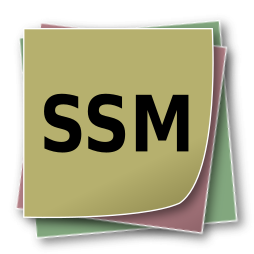
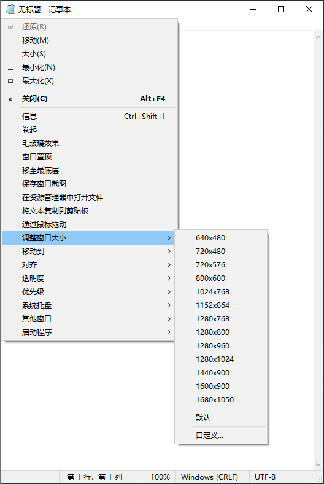
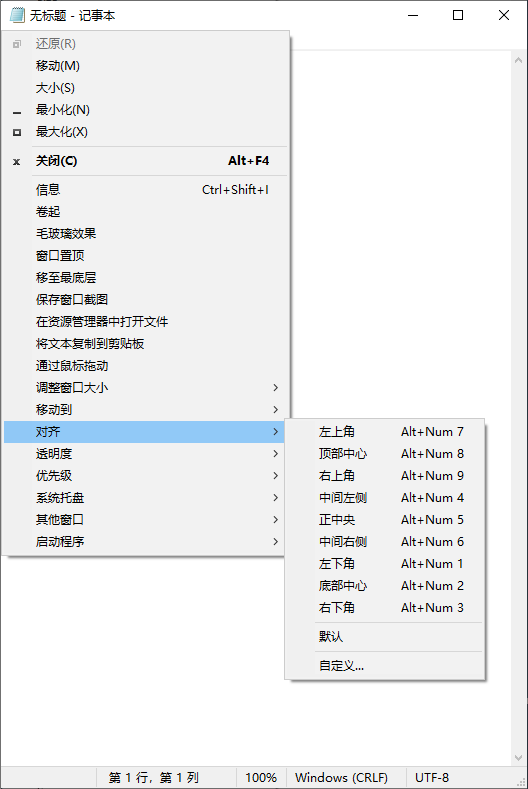
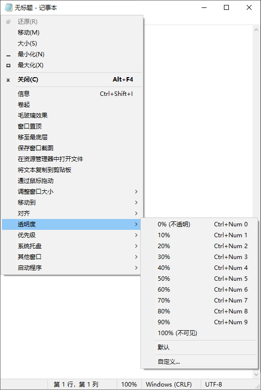
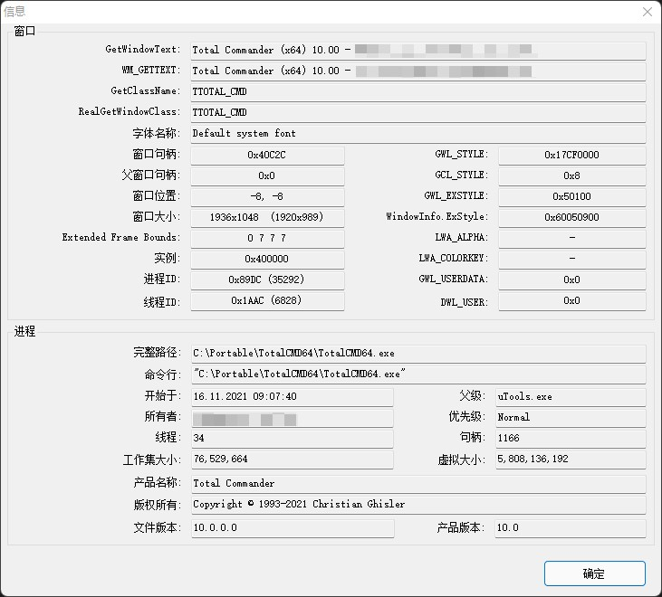

<div align="center">



# SmartSystemMenu

</div>

🌏: [English](/) [Русский](/README_RU.md) [**中文版**](/README_CN.md)

---

SmartSystemMenu 扩展了系统中所有窗口的系统菜单。 它会将下面的自定义项目追加到菜单:

* **详细信息.** 显示一个对话框，其中包含当前窗口和进程的信息：窗口句柄、窗口标题、窗口风格、窗口类、进程名称、进程ID、进程路径。
* **隐藏.** 允许隐藏当前窗口。
* **卷起窗口.** 将当前窗口向上卷起。
* **毛玻璃效果.** 将 "毛玻璃效果" 模糊添加到当前窗口。(仅 Windows Vista 及更高版本支持。主要用于控制台窗口。)
* **窗口始终置顶.** 将当前窗口保持在所有其他窗口之上。
* **更改图标.** 允许更改当前窗口的图标。
* **更改标题.** 允许更改当前窗口的标题。
* **窗口置底.** 将当前窗口保持在所有其他窗口之下。
* **保存窗口截图.** 将当前窗口的屏幕截图保存到文件中。
* **在资源管理器中进入程序路径.** 在文件资源管理器中打开进程文件。
* **通过鼠标拖动.** 允许通过鼠标拖动当前窗口。
* **点击时穿过窗口.** 允许点击穿透当前窗口。
* **在 Alt+Tab 列表中隐藏.** 允许当前窗口在任务栏和 Alt+Tab 切换中隐藏。
* **调整窗口大小到.** 更改当前窗口的大小。
* **移动到.** 将当前窗口移动到另一个显示器。
* **对齐窗口到.** 当前窗口与桌面上的9个位置中的任何一个对齐。
* **透明度.** 更改当前窗口的透明度。
* **优先级.** 更改当前窗口的程序优先级。
* **剪贴板操作.** 复制所有窗口文本 (包括控制台、MS Office 产品等) 到剪贴板中，同时支持清除剪贴板。
* **突出窗口操作.** 使除当前焦点窗口之外的所有窗口变暗。
* **按钮操作.** 允许禁用 "最小化" 、 "最大化" 和 "关闭" 按钮。
* **系统托盘.** 将当前窗口最小化或挂起到系统托盘。
* **其他窗口操作.** 关闭和最小化系统中除当前窗口之外的所有窗口。
* **启动.** 启动设置中的程序。

截图
------------------






## 命令行接口

```bash
   --help             The help
   --title            Title
   --titleBegins      Title begins 
   --titleEnds        Title ends
   --titleContains    Title contains
   --handle           Handle (1234567890) (0xFFFFFF)
   --processId        PID (1234567890)
-d --delay            Delay in milliseconds
-l --left             Left
-t --top              Top
-w --width            Width
-h --height           Height
-i --information      Information dialog
-s --savescreenshot   Save Screenshot
-m --monitor          [0, 1, 2, 3, ...]
-a --alignment        [topleft,
                       topcenter,
                       topright,
                       middleleft,
                       middlecenter,
                       middleright,
                       bottomleft,
                       bottomcenter,
                       bottomright,
                       centerhorizontally,
                       centervertically]
-p --priority         [realtime,
                       high,
                       abovenormal,
                       normal,
                       belownormal,
                       idle]
   --transparency     [0 ... 100]
   --alwaysontop      [on, off]
-g --aeroglass        [on, off]
   --hidealttab       [on, off]
   --clickthrough     [on, off]
   --minimizebutton   [on, off]
   --maximizebutton   [on, off]
   --sendtobottom     Send To Bottom
-o --openinexplorer   Open File In Explorer
-c --copytoclipboard  Copy Window Text To Clipboard
   --copyscreenshot   Copy Screenshot To Clipboard
   --clearclipboard   Clear Clipboard
   --trustedinstaller Sets TrustedInstaller owner for SmartSystemMenuHook.dll and SmartSystemMenuHook64.dll
-n --nogui            No GUI

Example:
SmartSystemMenu.exe --title "Untitled - Notepad" -a topleft -p high --alwaysontop on --nogui
```

## 安装方法

- 下载 [SmartSystemMenu](https://github.com/AlexanderPro/SmartSystemMenu/releases) zip 压缩包文件
- [Chocolatey](https://chocolatey.org/): `choco install smartsystemmenu`
- [Scoop](https://scoop.sh/): `scoop bucket add extras` and `scoop install extras/smartsystemmenu`
- [WinGet](https://github.com/microsoft/winget-cli): `winget install --id=AlexanderPro.SmartSystemMenu  -e`

要求
--------------------

* OS Windows XP SP3 及更高版本。 支持 x86 和 x64 系统。
* .NET Framework 4.0

程序文件
--------------------

* SmartSystemMenu.exe
* SmartSystemMenu64.exe (位于 SmartSystemMenu.exe 模块的资源中)
* SmartSystemMenuHook.dll
* SmartSystemMenuHook64.dll
* SmartSystemMenu.xml
* Language.xml

此程序具有用于 x86 进程的 SmartSystemMenu.exe 和 SmartSystemMenuHook.dll 模块，用于 x64 进程的 SmartSystemMenu64.exe 和 SmartSystemMenuHook64.dll 模块。当您运行 SmartSystemMenu.exe 时，它还会运行 SmartSystemMenu64.exe。 这两个可执行模块将挂钩 (SmartSystemMenuHook.dll 和 SmartSystemMenuHook64.dll) 加载到所有进程。 当您在系统菜单中选择一项时，挂钩会向可执行模块发送一条消息。之后，模块执行选定的操作：更改窗口的透明度、更改窗口的大小等等。

提示
--------------------

运行 SmartSystemMenu.exe 进程。如果您的操作系统启用了 UAC，系统将显示 UAC 对话框。您不必担心，因为程序需要提升权限。程序执行后，在所有窗口的所有系统菜单中都可以看到自定义项目。

## 关于中文语言

在第一次运行 SmartSystemMenu.exe 时，会自动检测系统语言环境，若为简体中文或繁体中文，自动应用对应的简体中文或繁体中文语言，后续亦可进入设置中修改显示语言，重新启动应用后生效。

