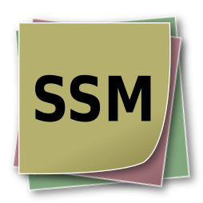
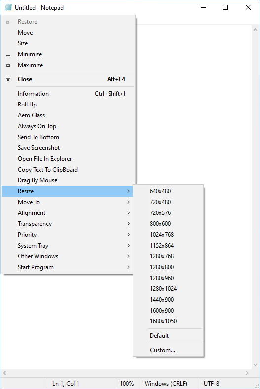
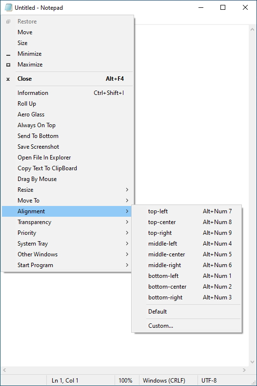
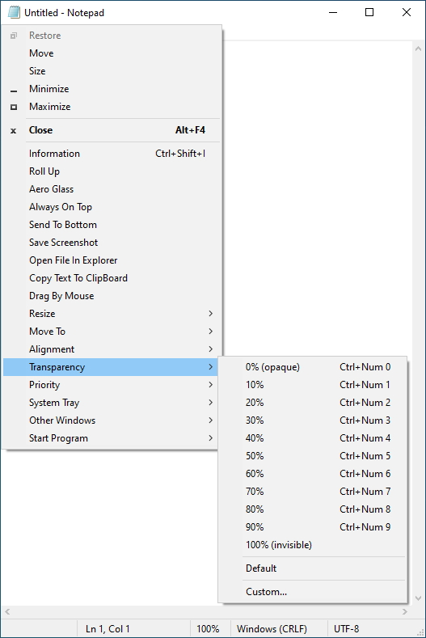
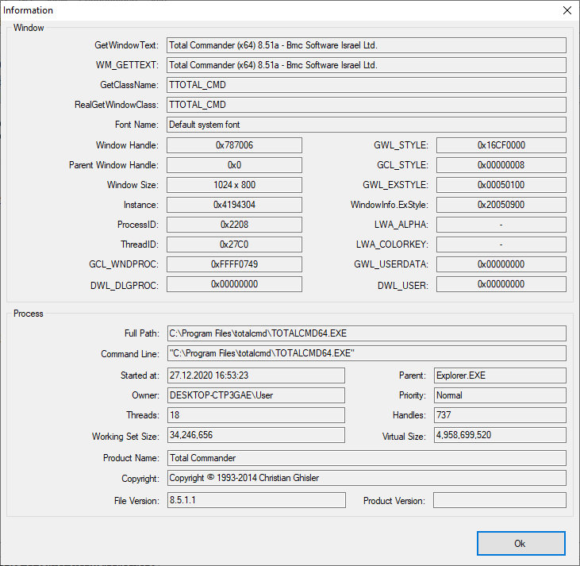

<div align="center">



# SmartSystemMenu

</div>

🌏: [English](/) [Русский](/README_RU.md) [中文版](/README_CN.md) [한국어](/README_KO.md) [**Bahasa Indonesia**](/README_ID.md)

---

SmartSystemMenu memperluas menu sistem pada semua jendela di sistem. Program ini menambahkan item kustom berikut ke menu:

* **Informasi.** Menampilkan dialog berisi informasi tentang jendela dan proses saat ini: handle jendela, judul jendela, gaya jendela, kelas jendela, nama proses, ID proses, dan jalur proses.
* **Sembunyikan.** Memungkinkan jendela saat ini disembunyikan.
* **Gulung ke Atas.** Memungkinkan jendela saat ini digulung ke atas dan dikembalikan.
* **Aero Glass.** Memungkinkan efek buram (blur) "Aero Glass" ditambahkan ke jendela saat ini. (Windows Vista atau yang lebih baru. Terutama digunakan untuk jendela konsol.)
* **Selalu di Atas.** Memungkinkan jendela saat ini tetap berada di atas semua jendela lain.
* **Ubah Ikon.** Memungkinkan ikon jendela saat ini diubah.
* **Ubah Judul.** Memungkinkan teks pada bilah judul diubah.
* **Kirim ke Belakang.** Memungkinkan jendela saat ini dikirim ke belakang.
* **Simpan Tangkapan Layar.** Memungkinkan tangkapan layar jendela saat ini disimpan ke file.
* **Buka File di Explorer.** Memungkinkan file proses dibuka di File Explorer.
* **Seret dengan Mouse.** Memungkinkan jendela saat ini diseret dengan mouse.
* **Klik Tembus.** Memungkinkan klik diteruskan menembus jendela saat ini.
* **Sembunyikan dari Alt+Tab.** Memungkinkan jendela saat ini disembunyikan dari Taskbar dan pengalih Alt+Tab.
* **Ubah Ukuran.** Memungkinkan ukuran jendela saat ini diubah.
* **Pindahkan ke.** Memungkinkan jendela saat ini dipindahkan ke monitor lain.
* **Perataan.** Memungkinkan jendela saat ini diratakan ke salah satu dari 9 posisi pada desktop.
* **Transparansi.** Memungkinkan transparansi jendela saat ini diubah.
* **Prioritas.** Memungkinkan prioritas program dari jendela saat ini diubah.
* **Papan Klip.** Memungkinkan semua teks jendela (termasuk konsol, produk MS Office, dan lainnya) disalin ke papan klip serta mengosongkan papan klip.
* **Peredup.** Meredupkan semua jendela kecuali jendela yang sedang mendapat fokus.
* **Tombol.** Memungkinkan tombol "Minimalkan", "Maksimalkan", dan "Tutup" dinonaktifkan.
* **Baki Sistem.** Memungkinkan jendela saat ini diminimalkan atau ditangguhkan ke baki sistem.
* **Jendela Lain.** Memungkinkan semua jendela di sistem selain jendela saat ini ditutup atau diminimalkan.
* **Jalankan Program.** Memungkinkan program yang ada di pengaturan dijalankan.

Tangkapan Layar
------------------






Antarmuka Baris Perintah
--------------------

```bash
   --help             The help
   --title            Title
   --titleBegins      Title begins
   --titleEnds        Title ends
   --titleContains    Title contains
   --handle           Handle (1234567890) (0xFFFFFF)
   --processId        PID (1234567890)
-d --delay            Delay in milliseconds
-l --left             Left
-t --top              Top
-w --width            Width
-h --height           Height
-i --information      Information dialog
-s --savescreenshot   Save Screenshot
-m --monitor          [0, 1, 2, 3, ...]
-a --alignment        [topleft,
                       topcenter,
                       topright,
                       middleleft,
                       middlecenter,
                       middleright,
                       bottomleft,
                       bottomcenter,
                       bottomright,
                       centerhorizontally,
                       centervertically]
-p --priority         [realtime,
                       high,
                       abovenormal,
                       normal,
                       belownormal,
                       idle]
   --transparency     [0 ... 100]
   --alwaysontop      [on, off]
-g --aeroglass        [on, off]
   --hidealttab       [on, off]
   --clickthrough     [on, off]
   --minimizebutton   [on, off]
   --maximizebutton   [on, off]
   --sendtobottom     Send To Bottom
-o --openinexplorer   Open File In Explorer
-c --copytoclipboard  Copy Window Text To Clipboard
   --copyscreenshot   Copy Screenshot To Clipboard
   --clearclipboard   Clear Clipboard
   --trustedinstaller Sets TrustedInstaller owner for SmartSystemMenuHook.dll and SmartSystemMenuHook64.dll
-n --nogui            No GUI

Example:
SmartSystemMenu.exe --title "Untitled - Notepad" -a topleft -p high --alwaysontop on --nogui
```

Instalasi
--------------------

* Unduh [SmartSystemMenu](https://github.com/AlexanderPro/SmartSystemMenu/releases) dalam file zip
* [Chocolatey](https://chocolatey.org/): `choco install smartsystemmenu`
* [Scoop](https://scoop.sh/): `scoop bucket add extras` dan `scoop install extras/smartsystemmenu`
* [WinGet](https://github.com/microsoft/winget-cli): `winget install --id=AlexanderPro.SmartSystemMenu  -e`

Persyaratan
--------------------

* OS Windows XP SP3 atau yang lebih baru. Mendukung sistem x86 dan x64.
* .NET Framework 4.0

File
--------------------

* SmartSystemMenu.exe
* SmartSystemMenu64.exe (terletak di sumber daya modul SmartSystemMenu.exe)
* SmartSystemMenuHook.dll
* SmartSystemMenuHook64.dll
* SmartSystemMenu.xml
* Language.xml

Program ini memiliki modul SmartSystemMenu.exe dan SmartSystemMenuHook.dll untuk proses x86 serta modul SmartSystemMenu64.exe dan SmartSystemMenuHook64.dll untuk proses x64. Saat SmartSystemMenu.exe dijalankan, SmartSystemMenu64.exe juga dijalankan. Kedua modul yang dapat dieksekusi ini memuat hook (SmartSystemMenuHook.dll dan SmartSystemMenuHook64.dll) ke semua proses. Saat item pada menu sistem dipilih, hook mengirim pesan ke modul yang dapat dieksekusi. Setelah itu, modul menjalankan tindakan yang dipilih, seperti mengubah transparansi jendela, mengubah ukuran jendela, dan sebagainya.

Tips
--------------------

Jalankan proses SmartSystemMenu.exe. Jika UAC diaktifkan pada OS, sistem akan menampilkan dialog UAC. Hal ini normal karena program memerlukan hak akses yang lebih tinggi. Setelah program dijalankan, item kustom akan terlihat pada menu sistem semua jendela.
