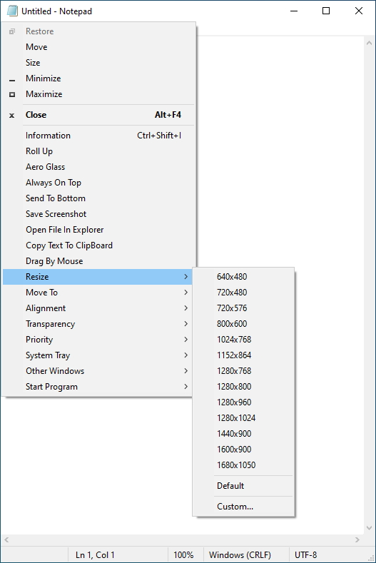
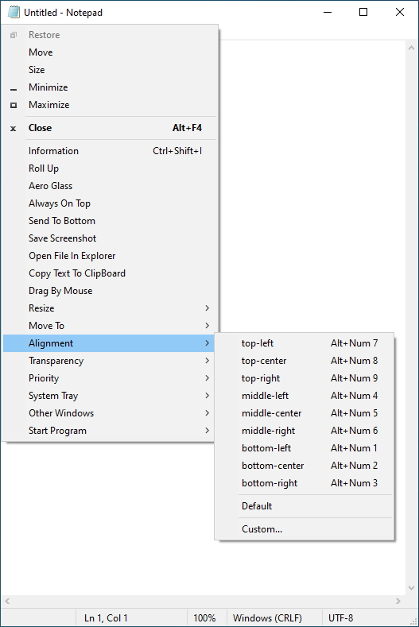
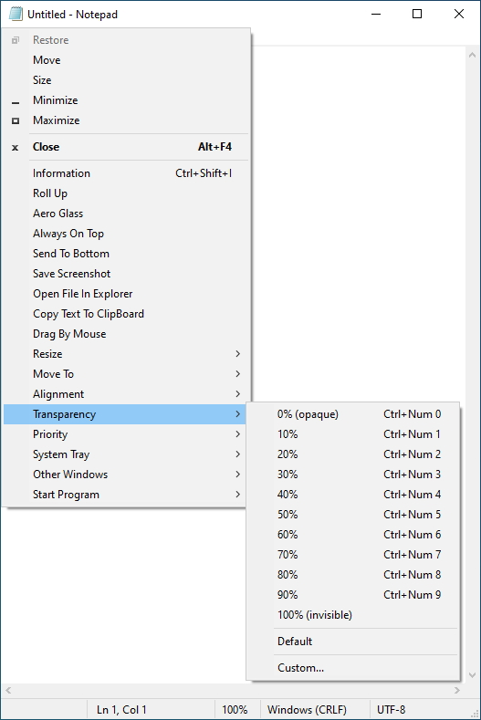
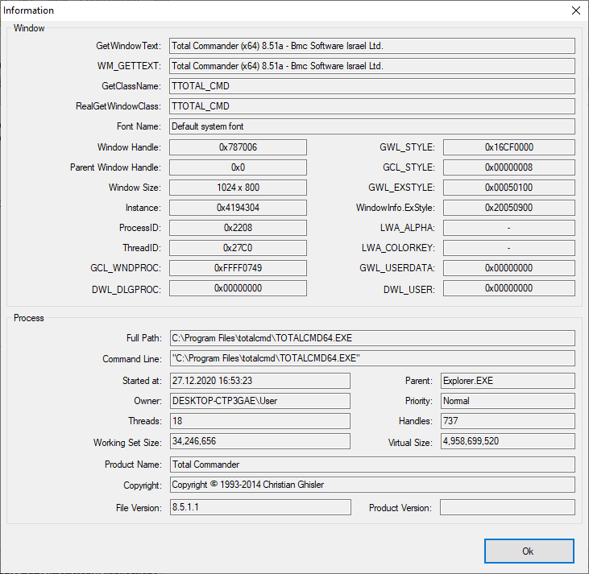

<div align="center">


# SmartSystemMenu

</div>

🌏: [English](/) [**한국어**](/README_KO.md) [Русский](/README_RU.md) [中文版](/README_CN.md)

---

SmartSystemMenu는 시스템의 모든 창에 대한 시스템 메뉴를 확장합니다. 다음 사용자 지정 항목을 메뉴에 추가합니다:

* **정보.** 현재 창과 프로세스에 대한 정보가 있는 대화 상자를 표시합니다. 여기에는 창 핸들, 창 캡션, 창 스타일, 창 클래스, 프로세스 이름, 프로세스 ID, 프로세스 경로가 포함됩니다.
* **숨기기.** 현재 창을 숨길 수 있습니다.
* **롤업.** 현재 창을 말아 올리거나 내릴 수 있습니다.
* **에어로 글래스.** 현재 창에 "에어로 글래스" 흐림 효과를 추가할 수 있습니다. (Windows Vista 이상. 주로 콘솔 창에 사용됨)
* **항상 맨 위에.** 현재 창을 다른 모든 창 위에 고정시킵니다.
* **아이콘 변경.** 현재 창의 아이콘을 변경할 수 있습니다.
* **제목 변경.** 제목 표시줄의 텍스트를 변경할 수 있습니다.
* **아래로 보내기** 현재 창을 아래로 보낼 수 있습니다.
* **스크린샷 저장.** 현재 창의 스크린샷을 파일에 저장할 수 있습니다.
* **탐색기에서 파일 열기.** 파일 탐색기에서 프로세스 파일을 열 수 있습니다.
* **마우스로 끌기.** 현재 창을 마우스로 드래그할 수 있습니다.
* **클릭 통과.** 현재 창을 통과하여 클릭할 수 있게 합니다.
* **Alt+Tab 숨기기.** 작업 표시줄 및 Alt+Tab 전환 시 현재 창을 숨깁니다
* **크기 조정.** 현재 창의 크기를 변경할 수 있습니다.
* **이동.** 현재 창을 다른 모니터로 이동할 수 있습니다.
* **정렬.** 현재 창을 바탕 화면의 9개 위치 중 원하는 위치에 맞출 수 있습니다.
* **투명도.** 현재 창의 투명도를 변경할 수 있습니다.
* **우선순위.** 현재 창의 프로그램 우선 순위를 변경할 수 있습니다.
* **클립보드.** 모든 창 텍스트 (콘솔, MS 오피스 제품 등 포함)를 클립보드에 복사하고 클립보드를 지울 수 있습니다.
* **어둡게.** 현재 초점이 있는 창을 제외한 모든 창을 어둡게 합니다.
* **버튼.** "최소화", "최대화" 및 "닫기" 버튼을 비활성화할 수 있습니다.
* **시스템 트레이.** 현재 창을 최소화하거나 시스템 트레이에 일시 중지할 수 있습니다.
* **기타 창.** 현재 창을 제외한 시스템의 모든 창을 닫고 최소화할 수 있습니다.
* **시작 프로그램.** 설정에서 프로그램을 시작할 수 있습니다.

스크린샷
------------------






명령줄 인터페이스
--------------------

```bash
   --help             도움말
   --title            제목
   --titleBegins      제목 시작
   --titleEnds        제목 끝
   --titleContains    제목 포함
   --handle           핸들 (1234567890) (0xFFFFFF)
   --processId        PID (1234567890)
-d --delay            지연 시간 (밀리초)
-l --left             왼쪽
-t --top              위쪽
-w --width            너비
-h --height           높이
-i --information      정보 대화상자
-s --savescreenshot   스크린샷 저장
-m --monitor          [0, 1, 2, 3, ...]
-a --alignment        [왼쪽 위,
                       위 가운데,
                       오른쪽 위,
                       왼쪽 중간,
                       정중앙,
                       오른쪽 중간,
                       왼쪽 아래,
                       아래 가운데,
                       오른쪽 아래,
                       가로 중심,
                       세로 중심]
-p --priority         [실시간,
                       높음,
                       정상 이상,
                       정상,
                       정상 이하,
                       유휴]
   --transparency     [0 ... 100]
   --alwaysontop      [켜기, 끄기]
-g --aeroglass        [켜기, 끄기]
   --hidealttab       [켜기, 끄기]
   --clickthrough     [켜기, 끄기]
   --minimizebutton   [켜기, 끄기]
   --maximizebutton   [켜기, 끄기]
   --sendtobottom     맨 아래로 보내기
-o --openinexplorer   탐색기에서 파일 열기
-c --copytoclipboard  창 텍스트를 클립보드에 복사
   --copyscreenshot   스크린샷을 클립보드에 복사
   --clearclipboard   클립보드 지우기
   --trustedinstaller SmartSystemMenuHook.dll 및 SmartSystemMenuHook64.dll에 대한 TrustedInstaller 소유자 설정
-n --nogui            GUI 없음

예:
SmartSystemMenu.exe --title "Untitled - Notepad" -a topleft -p high --alwaysontop on --nogui
```

설치
--------------------

* zip 파일에서 [SmartSystemMenu](https://github.com/AlexanderPro/SmartSystemMenu/releases) 다운로드
* [Chocolatey](https://chocolatey.org/): `choco install smartsystemmenu`
* [Scoop](https://scoop.sh/): `scoop bucket add extras` 및 `scoop install extras/smartsystemmenu`
* [WinGet](https://github.com/microsoft/winget-cli): `winget install --id=AlexanderPro.SmartSystemMenu  -e`

요구 사항
--------------------

* OS Windows XP SP3 이상. x86 및 x64 시스템을 지원합니다.
* .NET Framework 4.0

파일
--------------------

* SmartSystemMenu.exe
* SmartSystemMenu64.exe (located in resources of SmartSystemMenu.exe module)
* SmartSystemMenuHook.dll
* SmartSystemMenuHook64.dll
* SmartSystemMenu.xml
* Language.xml

이 프로그램에는 x86 프로세스에 대한 SmartSystemMenu.exe 및 SmartSystemMenuHook.dll 모듈, x64 프로세스에 대한 SmartSystemMenu64.exe 및 SmartSystemMenuHook64.dll 모듈이 있습니다. SmartSystemMenu.exe를 실행하면 SmartSystemMenu64.exe도 실행됩니다. 이 두 실행 모듈은 모든 프로세스에 후크 (SmartSystemMenuHook.dll 및 SmartSystemMenuHook64.dll)를 로드합니다. 시스템 메뉴에서 항목을 선택하면 후크가 실행 모듈에 메시지를 보냅니다. 그 후 모듈은 선택한 작업을 수행합니다: 창의 투명도 변경, 창 크기 변경 등.

팁
--------------------

SmartSystemMenu.exe 프로세스를 실행합니다. 운영 체제에서 UAC를 활성화한 경우 시스템에 UAC 대화 상자가 표시됩니다. 프로그램에 고급 권한이 필요하므로 걱정할 필요가 없습니다. 프로그램이 실행된 후에는 모든 창의 모든 시스템 메뉴에서 사용자 지정 항목을 볼 수 있습니다.
