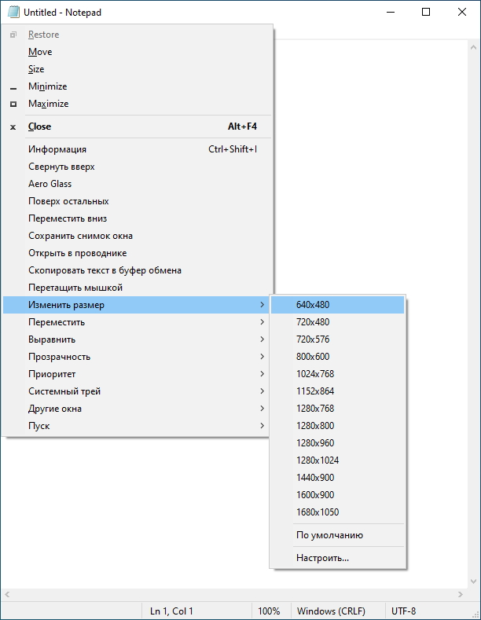
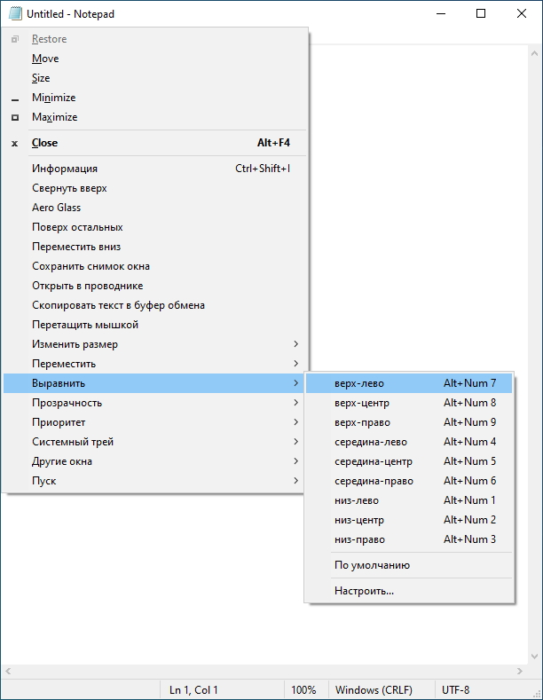
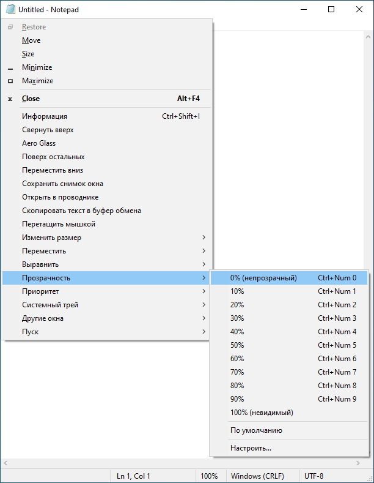
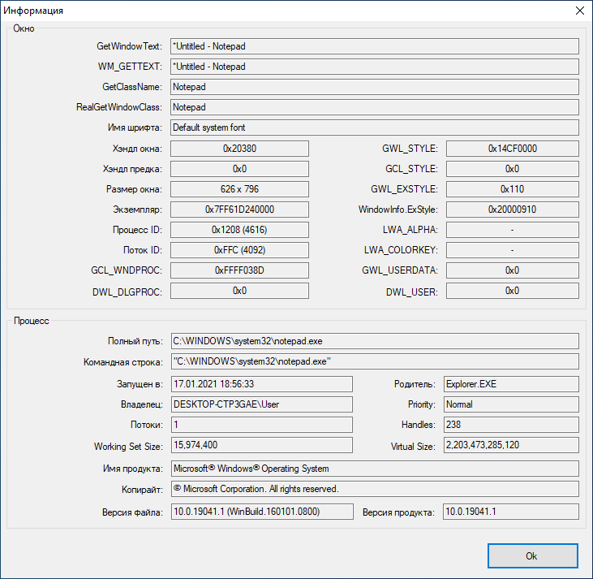

<div align="center">


# SmartSystemMenu

</div>

🌏: [English](/) [**Русский**](/README_RU.md) [中文版](/README_CN.md)

---

SmartSystemMenu добавляет дополнительные пункты системного меню, такие как:

* **Информация.** Отображает диалог с детальной информацией об окне и процессе, которому принадлежит окно.
* **Скрыть.** Позволяет скрыть окно.
* **Свернуть вверх.** Позволяет свернуть вверх до заголовка окно и обратно.
* **Aero Glass.** Включает для текущего окна режим "Aero Glass". (Поддерживается в Windows Vista and выше. Удобно по большей части для консольных окон.)
* **Поверх остальных.** Отображает окно поверх остальных окон системы.
* **Изменить заголовок.** Позволяет изменить заголовок окна.
* **Переместить вниз.** Отображает окно за всеми окнами системы.
* **Сохранить снимок окна.** Позволяет сохранить скриншот окна в файл.
* **Открыть в проводнике.** Открывает File Explorer с выделенным файлом процесса, которому принадлежит окно.
* **Перетащить мышкой.** Позволяет перетащить окно мышкой за любую его область.
* **Клик сквозь окно.** Позволяет выполнить клик сквозь окно.
* **Скрыть для Alt+Tab.** Позволяет скрыть окно на панели задач и при переключении Alt+Tab.
* **Изменить размер.** Позволяет изменить размер окна.
* **Переместить.** Позволяет перенести окно на другой монитор.
* **Выравнивание.** Позволяет выравнить окно в одной из 9 позиций.
* **Прозрачность.** Позволяет изменить прозрачность окна.
* **Приоритет.** Позволяет изменить приоритет процесса, которому принадлежит окно.
* **Буфер обмена.** Позволяет скопировать текст окна в буфер обмена или очистить буфер обмена.
* **Затемнение.** Затемняет монитор, кроме активного окна.
* **Кнопки.** Позволяет отключить кнопки минимизации, максимизации и закрытия окна.
* **Системный трей.** Сворачивает окно в системный трей.
* **Другие окна.** Позволяет закрыть или минимизировать все окна системы кроме текущего.
* **Пуск.** Запускает любой процесс заданный через настройки программы.

Скриншоты
------------------






Интерфейс командной строки
--------------------

```bash
   --help             The help
   --title            Title
   --titleBegins      Title begins 
   --titleEnds        Title ends
   --titleContains    Title contains
   --handle           Handle (1234567890) (0xFFFFFF)
   --processId        PID (1234567890)
-d --delay            Delay in milliseconds
-l --left             Left
-t --top              Top
-w --width            Width
-h --height           Height
-i --information      Information dialog
-s --savescreenshot   Save Screenshot
-m --monitor          [0, 1, 2, 3, ...]
-a --alignment        [topleft,
                       topcenter,
                       topright,
                       middleleft,
                       middlecenter,
                       middleright,
                       bottomleft,
                       bottomcenter,
                       bottomright,
                       centerhorizontally,
                       centervertically]
-p --priority         [realtime,
                       high,
                       abovenormal,
                       normal,
                       belownormal,
                       idle]
   --transparency     [0 ... 100]
   --alwaysontop      [on, off]
-g --aeroglass        [on, off]
   --hidealttab       [on, off]
   --clickthrough     [on, off]
   --minimizebutton   [on, off]
   --maximizebutton   [on, off]
   --sendtobottom     Send To Bottom
-o --openinexplorer   Open File In Explorer
-c --copytoclipboard  Copy Window Text To Clipboard
   --copyscreenshot   Copy Screenshot To Clipboard
   --clearclipboard   Clear Clipboard
   --trustedinstaller Sets TrustedInstaller owner for SmartSystemMenuHook.dll and SmartSystemMenuHook64.dll
-n --nogui            No GUI

Example:
SmartSystemMenu.exe --title "Untitled - Notepad" -a topleft -p high --alwaysontop on --nogui
```

Установка
--------------------

* Скачайте последнюю версию [SmartSystemMenu](https://github.com/AlexanderPro/SmartSystemMenu/releases) в zip файле
* [Chocolatey](https://chocolatey.org/): `choco install smartsystemmenu`
* [Scoop](https://scoop.sh/): `scoop bucket add extras` и `scoop install extras/smartsystemmenu`

Требования к системе
--------------------

* ОС Windows XP SP3 и выше. Поддержка x86 and x64 систем.
* .NET Framework 4.0

Файлы
--------------------

* SmartSystemMenu.exe
* SmartSystemMenu64.exe (находится в ресурсах SmartSystemMenu.exe)
* SmartSystemMenuHook.dll
* SmartSystemMenuHook64.dll
* SmartSystemMenu.xml
* Language.xml

Программа состоит из SmartSystemMenu.exe and SmartSystemMenuHook.dll модулей для x86 систем, SmartSystemMenu64.exe и SmartSystemMenuHook64.dll модулей для x64 систем. Когда запускается процесс SmartSystemMenu.exe, он так же стартует SmartSystemMenu64.exe процесс. Эти два процесса загружают хуки (SmartSystemMenuHook.dll и SmartSystemMenuHook64.dll) во все процессы системы. Когда выбирается один из добавленных пунктов меню, хук пересылает информацию об этом в основной процесс SmartSystemMenu.exe (SmartSystemMenu64.exe) и уже сам процесс выполняет действие.

Примечание
--------------------

При запуске SmartSystemMenu.exe отображается окно UAC, т.к. программе требуются привилегии для доступа к информации о процессах и окнах системы.